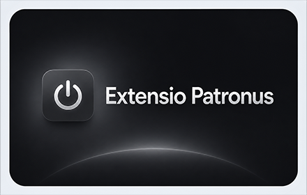
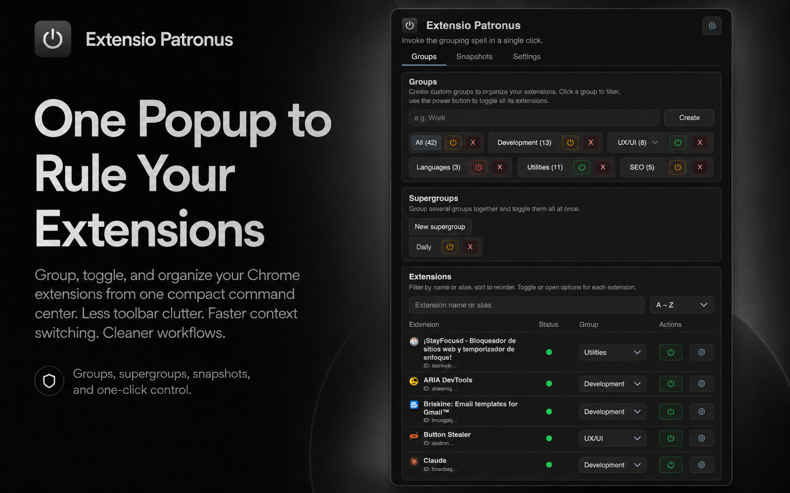
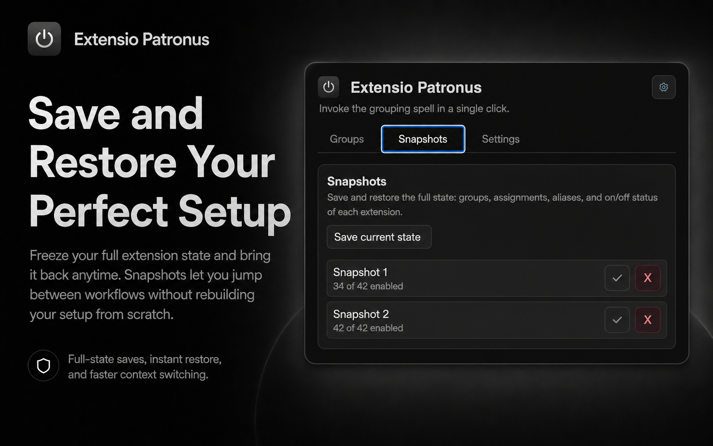
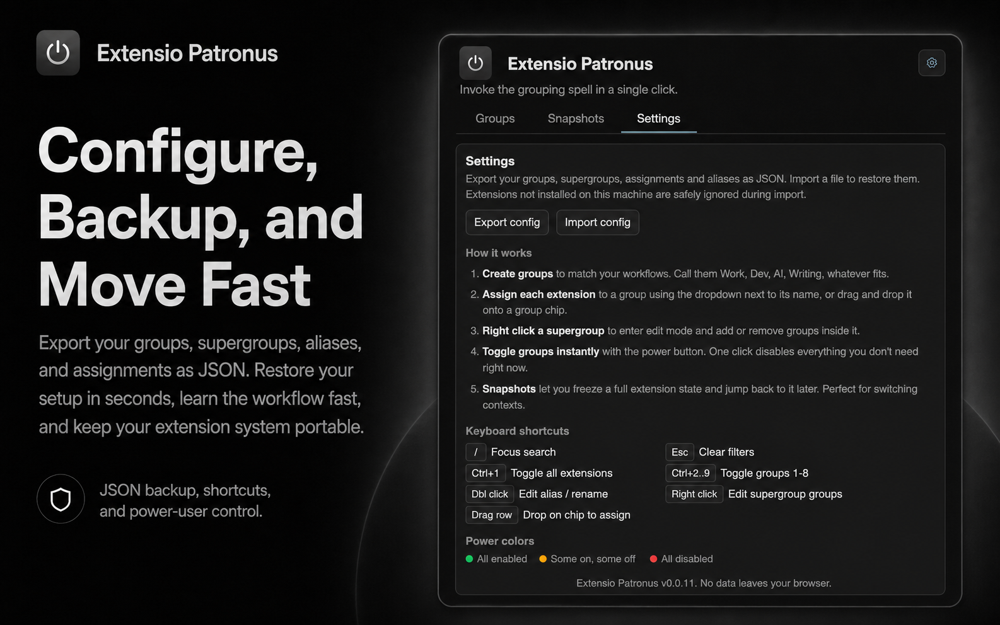

# Extensio Patronus

One popup to rule your Chrome extensions.

Extensio Patronus is a fast command center for people who use a lot of extensions and want less toolbar clutter, faster context switching, and cleaner workflows. Instead of pinning ten different extensions, you keep one icon pinned and control the rest from a compact, polished popup.

## Why It Exists

Chrome extensions are powerful, but managing many of them quickly becomes messy:

- your toolbar fills up
- switching between work modes is slow
- enabling and disabling sets of extensions is repetitive
- the browser gives you almost no high-level organization tools

Extensio Patronus fixes that with groups, supergroups, snapshots, search, and one-click toggles.

## Core Features

- **Groups**: organize extensions into buckets like Work, AI, Writing, Shopping, Privacy, or Dev.
- **Supergroups**: combine multiple groups into a larger setup you can toggle at once.
- **Snapshots**: save the full state of your extension setup and restore it later.
- **Search and aliases**: find extensions fast and rename them locally inside the popup.
- **Bulk toggle**: enable or disable all extensions in a group or supergroup in one click.
- **Minimal toolbar footprint**: keep only Extensio Patronus pinned.
- **JSON import/export**: back up your local setup and move it between machines.

## What Makes It Different

- Focused on **workflow switching**, not just listing extensions.
- Built as a **compact control panel**, not a bloated dashboard.
- Gives you **real structure** on top of Chrome’s flat extension list.
- Designed to feel quick, visual, and deliberate.

## Example Use Cases

- Turn on only your work stack for meetings and deep focus.
- Keep AI tools grouped separately from shopping or social extensions.
- Save a clean “recording / demo” snapshot with distractions disabled.
- Jump back to a previous setup in one click after testing or debugging.

## Visuals

### Promotional Tile

### Screenshots

## Privacy

Extensio Patronus is local-first.

- No account required
- No analytics
- No remote sync
- No external API calls
- No user data sold or shared

The extension stores its configuration locally in your browser using `chrome.storage.local`.

Read the full privacy policy here:

- [PRIVACY_POLICY.md](./PRIVACY_POLICY.md)

## Permissions Used

- `management`: list installed extensions and enable/disable them
- `storage`: store groups, aliases, supergroups, and snapshots locally
- `tabs`: open extension options or related pages when needed

## Chrome Platform Limitations

Some browser behaviors are intentionally restricted by Chrome:

- extensions cannot pin or unpin other extension icons via API
- extensions cannot open another extension’s popup on hover
- extension popups open on click, not on hover

Extensio Patronus is designed around those platform limits.

## Project Structure

- `manifest.json`
- `popup/popup.html`
- `popup/popup.css`
- `popup/popup.js`
- `icons/`
- `PRIVACY_POLICY.md`
- `LICENSE`

## Status

Submission pending
